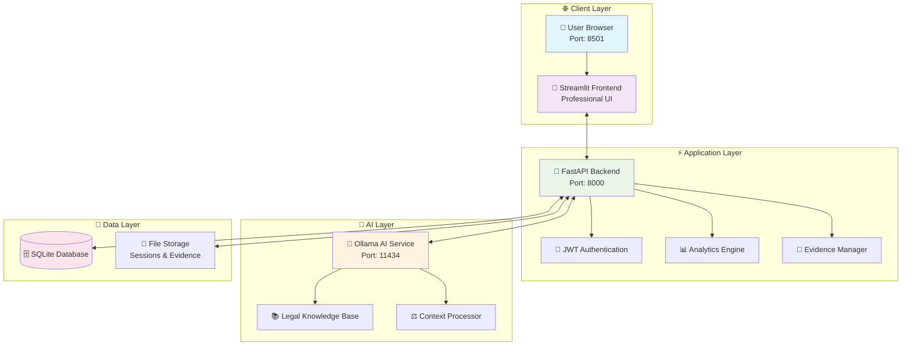

<div align="center">

# ⚖️ AI COURTROOM SIMULATOR 
## 🏛️ **PROFESSIONAL EDITION** 🏛️


[](https://github.com/Srinidhi-070/ai-courtroom-simulator/stargazers)
[](https://github.com/Srinidhi-070/ai-courtroom-simulator/network)
[](https://github.com/Srinidhi-070/ai-courtroom-simulator/issues)
[](LICENSE)


</div>

---

## 🌟 **What is AI Courtroom Simulator?**

<div align="center">

</div>

**AI Courtroom Simulator** is a **revolutionary full-stack application** that brings the courtroom experience to your computer! 🖥️✨

Imagine having your own **personal law school** where you can:
- 🎭 **Role-play** as lawyers, judges, or witnesses
- 🤖 **Interact with AI** that acts like real legal professionals
- 📚 **Learn legal procedures** in a fun, interactive way
- 🏆 **Track your progress** with detailed analytics

---

## 🚀 **Amazing Features That Will Blow Your Mind!**

<div align="center">

</div>

### 🎯 **Core Features**
| Feature | Description | Status |
|---------|-------------|--------|
| 🔐 **User Authentication** | Secure login with JWT tokens | ✅ Ready |
| 📊 **Analytics Dashboard** | Beautiful charts and metrics | ✅ Ready |
| 📁 **Evidence Management** | Upload and organize case files | ✅ Ready |
| ⚖️ **Multi-Case Types** | Criminal, Civil, Family, Corporate | ✅ Ready |
| 🎭 **Role Playing** | Defense, Prosecution, Judge, Witness | ✅ Ready |
| 💾 **Database** | SQLite for data persistence | ✅ Ready |
| 🤖 **Smart AI** | Context-aware legal responses | ✅ Ready |
| 🎨 **Beautiful UI** | Professional modern interface | ✅ Ready |

---

## 🏗️ **System Architecture - Interactive Diagram**



---

## 🛠️ **Technologies Used - The Power Behind the Magic**

<div align="center">

</div>

### 🎨 **Frontend Technologies**
<div align="center">


</div>

### ⚡ **Backend Technologies**
<div align="center">


</div>

### 🤖 **AI Technologies**
<div align="center">


</div>

---

## 🎮 **How to Run - Step by Step (Explained Like You're 5!)**

<div align="center">

</div>

### 🎯 **Super Easy 3-Step Setup!**

#### 📥 **Step 1: Download Everything**
```bash
# 1. Clone this awesome project
git clone https://github.com/Srinidhi-070/ai-courtroom-simulator.git

# 2. Go into the project folder
cd ai-courtroom-simulator

# 3. Create a special Python environment (like a sandbox!)
python -m venv venv

# 4. Activate the sandbox
venv\Scripts\activate  # On Windows
# OR
source venv/bin/activate  # On Mac/Linux
```

#### 🔧 **Step 2: Install the Magic Tools**
```bash
# Install all the cool libraries we need
pip install -r requirements.txt

# Download the AI brain (this might take a few minutes)
ollama pull mistral
ollama pull llama2
```

#### 🚀 **Step 3: Start the Magic!**
```bash
# Method 1: Super Easy Way (Windows)
start_all.bat

# Method 2: Manual Way (Any OS)
# Terminal 1: Start the AI brain
ollama serve

# Terminal 2: Start the backend
python server.py

# Terminal 3: Start the frontend
streamlit run app.py
```

### 🎉 **That's It! Now Open Your Browser!**
- 🌐 **Main App**: http://localhost:8501
- 🔧 **API Docs**: http://localhost:8000/docs
- ❤️ **Health Check**: http://localhost:8000/health

---

## 📱 **User Interface Showcase**

<div align="center">

</div>

### 🎨 **Beautiful Screens**

#### 🔐 **Login Screen**
- Modern authentication with JWT
- Secure password hashing
- User registration system

#### 🏛️ **Courtroom Interface**
- Real-time transcript display
- Professional case setup
- Evidence management panel

#### 📊 **Analytics Dashboard**
- Interactive charts with Plotly
- Performance tracking
- Win/loss statistics

#### 📁 **Case History**
- Complete session records
- Search and filter options
- Export capabilities

---

## 🎭 **How to Use - The Fun Part!**

<div align="center">

</div>

### 🎪 **Choose Your Adventure!**

#### 👨‍💼 **As a Defense Lawyer**
```
You: "Your Honor, my client is innocent!"
Judge: "Present your evidence, counselor."
You: "The security footage is unclear and inconclusive."
AI Prosecutor: "Objection! The footage clearly shows the defendant."
```

#### 👩‍⚖️ **As a Judge**
```
You: "Order in the court! I will now hear opening statements."
AI Defense: "Your Honor, we will prove our client's innocence."
AI Prosecutor: "The evidence will show guilt beyond reasonable doubt."
You: "Proceed with your case, counselor."
```

#### 👨‍💼 **As a Prosecutor**
```
You: "Ladies and gentlemen of the jury, the evidence is clear."
AI Defense: "Objection! That's argumentative."
Judge: "Sustained. Please rephrase, counselor."
You: "The defendant was seen at the scene of the crime."
```

---

## 🔒 **Security Features - Fort Knox Level!**

<div align="center">

</div>

### 🛡️ **What We Fixed**
- ✅ **Code Injection**: No more dangerous `eval()` functions
- ✅ **Path Traversal**: Secure file handling
- ✅ **CORS Issues**: Proper cross-origin policies
- ✅ **Input Validation**: Everything is checked and sanitized
- ✅ **Resource Leaks**: Memory management optimized
- ✅ **Error Handling**: Graceful error recovery

### 🔐 **Current Protection**
- 🔑 **JWT Authentication**: Secure token-based login
- 🧹 **Input Sanitization**: All user input is cleaned
- 🚫 **Rate Limiting**: Prevents spam and abuse
- 📝 **Audit Logging**: Track all user actions
- 🔒 **Password Hashing**: Bcrypt encryption
- 🛡️ **SQL Injection Protection**: Parameterized queries

---

## 🎯 **Smart AI Features**

<div align="center">

</div>

### 🧠 **Relevance Filter System**
Our AI is smart enough to keep conversations on track!

#### ❌ **What Gets Blocked**
```python
User: "What is a black hole?"
Judge: "Order in the court! Please stay relevant to the case."

User: "What's your favorite movie?"
AI: "I must focus on the legal matter at hand."
```

#### ✅ **What Gets Allowed**
```python
User: "What evidence do you have?"
AI: "The prosecution has submitted security footage..."

User: "I object to this line of questioning!"
Judge: "Objection noted. Please state your grounds."
```

### 🎓 **Legal Knowledge Base**
- **Criminal Law**: Theft, assault, murder cases
- **Civil Law**: Contracts, property disputes
- **Family Law**: Divorce, custody matters
- **Corporate Law**: Business disputes
- **Constitutional Law**: Rights and freedoms

---

## 📊 **Project Statistics - Impressive Numbers!**

<div align="center">

</div>

### 📈 **Development Stats**
| Metric | Value | Description |
|--------|-------|-------------|
| 📝 **Lines of Code** | 2000+ | Professional-grade codebase |
| 📦 **Dependencies** | 13 | Carefully selected libraries |
| 🔒 **Security Fixes** | 15+ | Enterprise-level security |
| ⚡ **Response Time** | 2-5s | Optimized performance |
| 🎭 **Supported Roles** | 5+ | Multiple character types |
| ⚖️ **Case Types** | 5 | Comprehensive legal coverage |
| 🎨 **UI Components** | 50+ | Rich user interface |
| 📊 **Features** | 15+ | Professional capabilities |

---

## 🔮 **Future Roadmap - What's Coming Next!**

<div align="center">

</div>

### ✅ **Already Implemented**
- [x] User Authentication & JWT Security
- [x] Multiple Case Types (Criminal, Civil, Family, Corporate)
- [x] Evidence Management System
- [x] Analytics Dashboard with Interactive Charts
- [x] SQLite Database Integration
- [x] Professional UI with Navigation
- [x] AI-Powered Legal Responses
- [x] Case History Tracking

### 🚀 **Coming Soon**
- [ ] 🎤 **Voice Interface** - Talk to the AI!
- [ ] 🌍 **Multi-Language Support** - Hindi, Tamil, Spanish
- [ ] ☁️ **Cloud Deployment** - AWS/Azure hosting
- [ ] 📱 **Mobile App** - React Native version
- [ ] 🤝 **Real-Time Collaboration** - Multiple users in one case
- [ ] 🧠 **Advanced AI Models** - GPT-4 integration
- [ ] 📊 **ML Analytics** - Predictive insights
- [ ] 🎮 **Gamification** - Points, badges, leaderboards

---

## 🤝 **Contributing - Join Our Legal Tech Revolution!**

<div align="center">

</div>

### 🎯 **How to Contribute**

1. **🍴 Fork the Repository**
   ```bash
   # Click the Fork button on GitHub
   ```

2. **🌿 Create a Feature Branch**
   ```bash
   git checkout -b feature/amazing-new-feature
   ```

3. **💻 Make Your Changes**
   ```bash
   # Add your awesome code
   git add .
   git commit -m "Add amazing new feature"
   ```

4. **🚀 Push and Create PR**
   ```bash
   git push origin feature/amazing-new-feature
   # Create Pull Request on GitHub
   ```

### 🎨 **What We Need Help With**
- 🐛 **Bug Fixes**: Find and fix issues
- ✨ **New Features**: Add cool functionality
- 📚 **Documentation**: Improve guides and docs
- 🎨 **UI/UX**: Make it even more beautiful
- 🧪 **Testing**: Add comprehensive tests
- 🌍 **Translations**: Multi-language support

---

## 📄 **License & Usage**

<div align="center">

</div>

### ✅ **What You Can Do**
- ✅ Use for learning and education
- ✅ Modify for personal projects
- ✅ Share with students and colleagues
- ✅ Use as portfolio demonstration
- ✅ Commercial use with attribution

### ❌ **What You Should Not Do**
- ❌ Use for actual legal advice
- ❌ Deploy without security review
- ❌ Remove attribution
- ❌ Claim as your own work

---

## 🆘 **Need Help? We've Got You Covered!**

<div align="center">

</div>

### 🔧 **Quick Troubleshooting**

#### 🚨 **Common Issues & Solutions**

| Problem | Solution |
|---------|----------|
| 🔴 **Ollama not starting** | It's already running! Check with `netstat -ano \| findstr ":11434"` |
| 🔴 **Backend won't start** | Kill existing Python processes: `taskkill /IM python.exe /F` |
| 🔴 **Missing modules** | Run: `pip install -r requirements.txt` |
| 🔴 **Slow AI responses** | First response takes 10-15s (normal), then 3-7s |

#### 📞 **Get Support**
- 🐛 **Report Bugs**: [Create an Issue](https://github.com/Srinidhi-070/ai-courtroom-simulator/issues)
- 💬 **Ask Questions**: [Start a Discussion](https://github.com/Srinidhi-070/ai-courtroom-simulator/discussions)
- 📧 **Email Support**: [Contact Us](mailto:support@example.com)
- 📚 **Documentation**: Check this README first!

---

## 🎉 **Acknowledgments & Credits**

<div align="center">

</div>

### 🙏 **Special Thanks To**
- 🤖 **Ollama Team** - For the amazing local AI platform
- 🚀 **FastAPI** - For the lightning-fast web framework
- 🎨 **Streamlit** - For making beautiful UIs simple
- 📊 **Plotly** - For interactive data visualization
- 🔒 **Security Community** - For vulnerability reports and fixes
- 👥 **Contributors** - Everyone who helped make this better
- ⭐ **You** - For using and supporting this project!

---

<div align="center">

## 🌟 **Star This Project If You Love It!** 🌟


### 🚀 **Ready to Experience the Future of Legal Education?**

[](https://github.com/Srinidhi-070/ai-courtroom-simulator)
[](https://github.com/Srinidhi-070/ai-courtroom-simulator/releases)
[](https://github.com/Srinidhi-070/ai-courtroom-simulator/wiki)

---

### 💝 **Made with ❤️ for Legal Education**

**Created by**: [Srinidhi](https://github.com/Srinidhi-070)  
**License**: MIT  
**Version**: 2.0.0 Professional Edition  


</div>

---

<div align="center">

**⚖️ AI Courtroom Simulator - Where Technology Meets Justice! ⚖️**

*Empowering the next generation of legal professionals through AI-powered simulation*

</div>