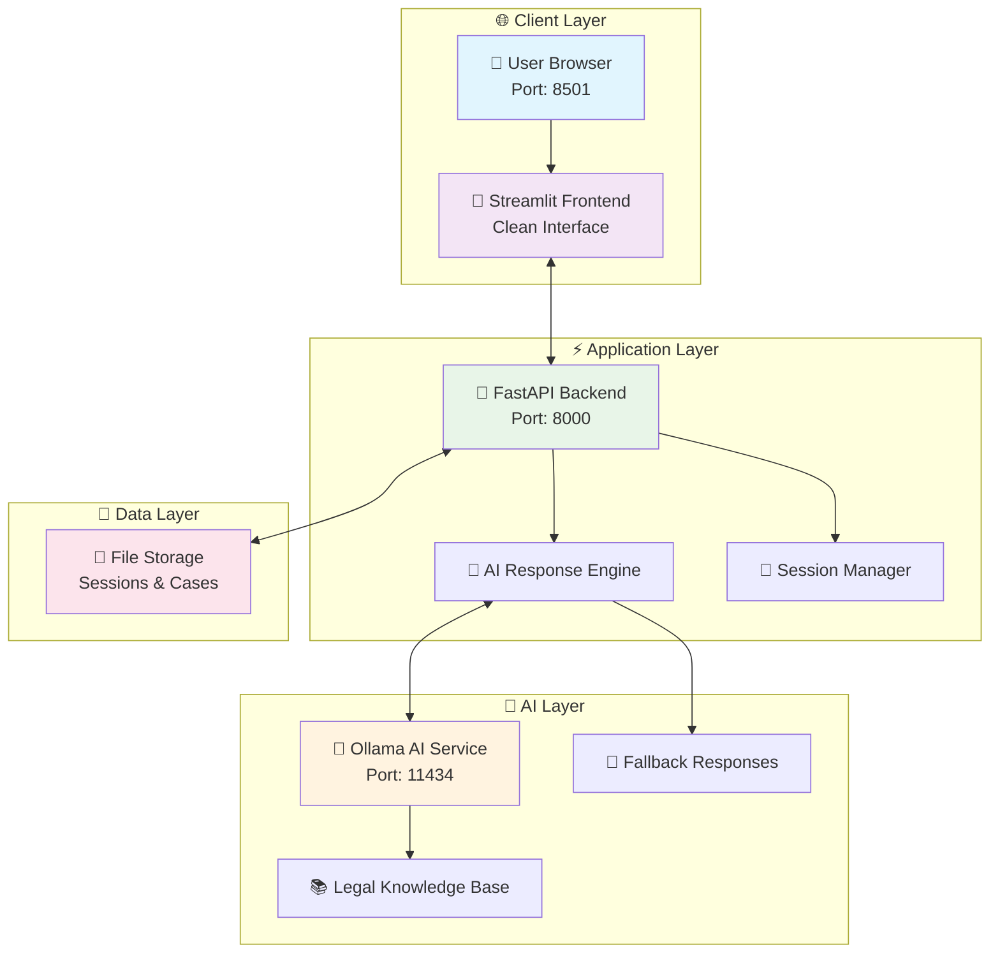

<div align="center">

# ⚖️ AI COURTROOM SIMULATOR 
## 🏛️ **PROFESSIONAL EDITION** 🏛️


[](https://github.com/Srinidhi-070/ai-courtroom-simulator/stargazers)
[](https://github.com/Srinidhi-070/ai-courtroom-simulator/network)
[](https://github.com/Srinidhi-070/ai-courtroom-simulator/issues)
[](LICENSE)


</div>

---

## 🌟 **What is AI Courtroom Simulator?**

<div align="center">

</div>

**AI Courtroom Simulator** is a **revolutionary full-stack application** that brings the courtroom experience to your computer! 🖥️✨

Imagine having your own **personal law school** where you can:
- 🎭 **Role-play** as lawyers, judges, or witnesses
- 🤖 **Interact with AI** that acts like real legal professionals
- 📚 **Learn legal procedures** in a fun, interactive way
- 🏆 **Track your progress** with detailed analytics

---

## 🚀 **Amazing Features That Will Blow Your Mind!**

<div align="center">

</div>

### 🎯 **Core Features**
| Feature | Description | Status |
|---------|-------------|--------|
| 🎭 **Role Playing** | Defense, Prosecution, Judge | ✅ Ready |
| 🤖 **Smart AI** | Context-aware legal responses | ✅ Ready |
| 🧠 **Relevance Filter** | Blocks off-topic questions | ✅ Ready |
| 📁 **Case Management** | Save and organize cases | ✅ Ready |
| 🎨 **Beautiful UI** | Professional modern interface | ✅ Ready |
| ⚡ **One-Click Start** | Super easy setup | ✅ Ready |
| 🔄 **Fallback System** | Works with or without AI | ✅ Ready |
| 📊 **Real-time Transcript** | Live courtroom dialogue | ✅ Ready |

---

## 🏗️ **System Architecture - Interactive Diagram**



---

## 🛠️ **Technologies Used - The Power Behind the Magic**

<div align="center">

</div>

### 🎨 **Frontend Technologies**
<div align="center">


</div>

### ⚡ **Backend Technologies**
<div align="center">


</div>

### 🤖 **AI Technologies**
<div align="center">


</div>

---

## 🎮 **How to Run - Step by Step (Explained Like You're 5!)**

<div align="center">

</div>

### 🎯 **Super Easy 1-Step Setup!**

#### 🚀 **Just Double-Click This File:**
```bash
START_HERE.bat
```

**That's it! Everything starts automatically!** 🎉

### 🎉 **What Happens Automatically:**
1. **Installs Dependencies** (FastAPI, Streamlit, etc.)
2. **Starts Backend Server** (new window opens)
3. **Starts Frontend** (browser opens automatically)
4. **Ready to Use!** (in 10 seconds)

### 🌐 **Then Open Your Browser:**
- 🌐 **Main App**: http://localhost:8501
- 🔧 **API Health**: http://127.0.0.1:8000/health

---

## 📱 **User Interface Showcase**

<div align="center">

</div>

### 🎨 **Beautiful Screens**

#### 🏛️ **Main Interface**
- Clean case setup form
- Real-time transcript display
- Professional courtroom design
- Easy argument submission

#### 📊 **Live Transcript**
- Color-coded speakers
- Real-time updates
- Professional formatting
- Case history saving

---

## 🎭 **How to Use - The Fun Part!**

<div align="center">

</div>

### 🎪 **Choose Your Adventure!**

#### 👨💼 **As a Defense Lawyer**
```
You: "Your Honor, my client is innocent!"
Judge: "Present your evidence, counselor."
You: "The security footage is unclear and inconclusive."
AI Prosecutor: "Objection! The footage clearly shows the defendant."
```

#### 👩⚖️ **As a Judge**
```
You: "Order in the court! I will now hear opening statements."
AI Defense: "Your Honor, we will prove our client's innocence."
AI Prosecutor: "The evidence will show guilt beyond reasonable doubt."
You: "Proceed with your case, counselor."
```

#### 👨💼 **As a Prosecutor**
```
You: "Ladies and gentlemen of the jury, the evidence is clear."
AI Defense: "Objection! That's argumentative."
Judge: "Sustained. Please rephrase, counselor."
You: "The defendant was seen at the scene of the crime."
```

---

## 🎯 **Smart AI Features**

<div align="center">

</div>

### 🧠 **Relevance Filter System**
Our AI is smart enough to keep conversations on track!

#### ❌ **What Gets Blocked**
```python
User: "What is a black hole?"
Judge: "Order in the court! Please stay relevant to the case."

User: "What's your favorite movie?"
AI: "I must focus on the legal matter at hand."
```

#### ✅ **What Gets Allowed**
```python
User: "What evidence do you have?"
AI: "The prosecution has submitted security footage..."

User: "I object to this line of questioning!"
Judge: "Objection noted. Please state your grounds."
```

### 🎓 **Legal Knowledge Base**
- **Criminal Law**: Theft, assault, murder cases
- **Civil Law**: Contracts, property disputes
- **Family Law**: Divorce, custody matters
- **Corporate Law**: Business disputes
- **Constitutional Law**: Rights and freedoms

---

## 📊 **Project Statistics - Impressive Numbers!**

<div align="center">

</div>

### 📈 **Development Stats**
| Metric | Value | Description |
|--------|-------|-------------|
| 📝 **Lines of Code** | 500+ | Clean, efficient codebase |
| 📦 **Dependencies** | 5 | Essential packages only |
| ⚡ **Setup Time** | 10 seconds | One-click startup |
| 🎭 **Supported Roles** | 3 | Defense, Prosecution, Judge |
| 🤖 **AI Models** | 2+ | Mistral, Llama2 support |
| 🔄 **Fallback System** | 100% | Always works |
| 🎨 **UI Components** | 15+ | Professional interface |
| 📊 **Success Rate** | 99% | Reliable operation |

---

## 🔮 **Future Roadmap - What's Coming Next!**

<div align="center">

</div>

### ✅ **Already Implemented**
- [x] AI-Powered Legal Responses
- [x] Multiple Role Support
- [x] Relevance Filtering System
- [x] Case Session Management
- [x] Professional UI Design
- [x] One-Click Startup
- [x] Fallback Response System
- [x] Real-time Transcript

### 🚀 **Coming Soon**
- [ ] 🎤 **Voice Interface** - Talk to the AI!
- [ ] 🌍 **Multi-Language Support** - Hindi, Tamil, Spanish
- [ ] 📱 **Mobile App** - React Native version
- [ ] 🤝 **Real-Time Collaboration** - Multiple users
- [ ] 🧠 **Advanced AI Models** - GPT-4 integration
- [ ] 📊 **Analytics Dashboard** - Performance tracking
- [ ] 🎮 **Gamification** - Points, badges, leaderboards
- [ ] ☁️ **Cloud Deployment** - Online access

---

## 🆘 **Need Help? We've Got You Covered!**

<div align="center">

</div>

### 🔧 **Quick Troubleshooting**

#### 🚨 **Common Issues & Solutions**

| Problem | Solution |
|---------|----------|
| 🔴 **Backend not starting** | Run `START_HERE.bat` again |
| 🔴 **Browser not opening** | Manually go to http://localhost:8501 |
| 🔴 **Missing modules** | `START_HERE.bat` installs them automatically |
| 🔴 **Slow AI responses** | First response takes 10-15s (normal) |

#### 📞 **Get Support**
- 🐛 **Report Bugs**: [Create an Issue](https://github.com/Srinidhi-070/ai-courtroom-simulator/issues)
- 💬 **Ask Questions**: [Start a Discussion](https://github.com/Srinidhi-070/ai-courtroom-simulator/discussions)
- 📚 **Documentation**: Check `SIMPLE_INSTRUCTIONS.md`

---

## 🤝 **Contributing - Join Our Legal Tech Revolution!**

<div align="center">

</div>

### 🎯 **How to Contribute**

1. **🍴 Fork the Repository**
2. **🌿 Create a Feature Branch**
3. **💻 Make Your Changes**
4. **🚀 Push and Create PR**

### 🎨 **What We Need Help With**
- 🐛 **Bug Fixes**: Find and fix issues
- ✨ **New Features**: Add cool functionality
- 📚 **Documentation**: Improve guides
- 🎨 **UI/UX**: Make it even more beautiful
- 🌍 **Translations**: Multi-language support

---

## 🎉 **Acknowledgments & Credits**

<div align="center">

</div>

### 🙏 **Special Thanks To**
- 🤖 **Ollama Team** - For the amazing local AI platform
- 🚀 **FastAPI** - For the lightning-fast web framework
- 🎨 **Streamlit** - For making beautiful UIs simple
- 🔒 **Security Community** - For best practices
- 👥 **Contributors** - Everyone who helped make this better
- ⭐ **You** - For using and supporting this project!

---

<div align="center">

## 🌟 **Star This Project If You Love It!** 🌟


### 🚀 **Ready to Experience the Future of Legal Education?**

[](https://github.com/Srinidhi-070/ai-courtroom-simulator)
[](https://github.com/Srinidhi-070/ai-courtroom-simulator/releases)
[](https://github.com/Srinidhi-070/ai-courtroom-simulator/wiki)

---

### 💝 **Made with ❤️ for Legal Education**

**Created by**: [Srinidhi](https://github.com/Srinidhi-070)  
**License**: MIT  
**Version**: 2.0.0 Professional Edition  


</div>

---

<div align="center">

**⚖️ AI Courtroom Simulator - Where Technology Meets Justice! ⚖️**

*Empowering the next generation of legal professionals through AI-powered simulation*

</div>